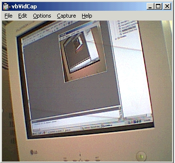



## Vb Video Capture

### Description

This Is a program for Video Devices it works for Cammera And Capture Card [Tv Card] etc.. i tested it on 5 Devices and it works coool please vote me! you may contact me in icq my uin is : 94900000 i hope you lov my Code!
 
### More Info
 

             |
---                |---
**Submitted On**   |2001-06-09 17:21:24
**By**             |[N/A](https://github.com/Planet-Source-Code/PSCIndex/blob/master/ByAuthor/empty.md)
**Level**          |Advanced
**User Rating**    |4.7 (93 globes from 20 users)
**Compatibility**  |VB 5\.0, VB 6\.0
**Category**       |[Complete Applications](https://github.com/Planet-Source-Code/PSCIndex/blob/master/ByCategory/complete-applications__1-27.md)
**World**          |[Visual Basic](https://github.com/Planet-Source-Code/PSCIndex/blob/master/ByWorld/visual-basic.md)
**Archive File**   |[Vb Video C20871692001\.zip](https://github.com/Planet-Source-Code/vb-video-capture__1-23923/archive/master.zip)

